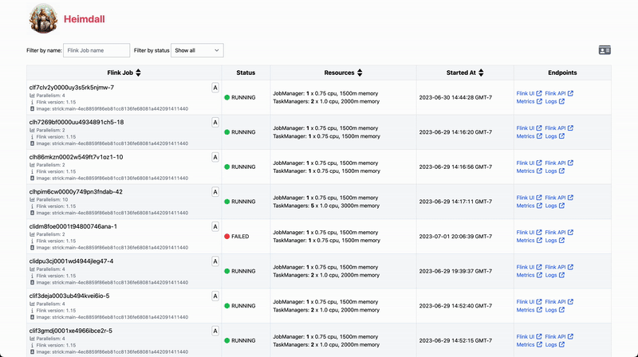

# Heimdall

[](https://github.com/next-govejero/heimdall/actions/workflows/build.yml)
[](https://github.com/sap1ens/heimdall/pkgs/container/heimdall)

Heimdall is a dashboard for operating Flink jobs and deployments. The built-in Flink UI is extremely useful when dealing with
a single job, but what if you have 10, 20, or 100 jobs? Heimdall helps you keep track of all your Flink jobs by searching, filtering, sorting, and navigating them from a single unified interface.

Read more in the blog: [Heimdall: Making Operating Flink Deployments a Bit Easier](https://sap1ens.com/blog/2023/07/09/heimdall-making-operating-flink-deployments-a-bit-easier/).

**Note:** Currently, Heimdall only supports Flink jobs deployed with [Flink Kubernetes Operator](https://ci.apache.org/projects/flink/flink-kubernetes-operator-docs-stable/).



## Features

- 🔍 **Search & Filter** - Quickly find jobs across multiple deployments
- 📊 **Job Overview** - View status, state, and metadata for all jobs at a glance
- 🔗 **Quick Links** - Direct access to Flink UI, metrics, and logs for each job
- 🏷️ **Metadata Support** - Display custom labels and annotations from Kubernetes resources
- ⚡ **Performance** - In-memory caching for fast response times
- 🔐 **Kubernetes Native** - Designed to run alongside Flink Operator in your cluster

## Table of Contents

- [Quick Start](#quick-and-dirty-start)
- [Installation](#installation)
- [Job Locators](#job-locators)
- [Configuration](#configuration)
- [Development](#development)
- [Testing](#testing)
- [Sponsors](#sponsors)

## Quick (and Dirty) Start

```bash
kubectl apply -f https://raw.githubusercontent.com/sap1ens/heimdall/main/tools/k8s-operator/service-account.yaml
kubectl run heimdall --image=ghcr.io/sap1ens/heimdall:0.10.0 --port=8080 --overrides='{ "spec": { "serviceAccount": "heimdall-service-account" }  }'
kubectl port-forward heimdall 8080:8080
open http://localhost:8080
```

## Installation

Heimdall is available as a Docker container [here](https://github.com/sap1ens/heimdall/pkgs/container/heimdall). Since only
Flink Kubernetes Operator is available at the moment, you'd typically deploy Heimdall as a pod or deployment in the same Kubernetes cluster where your Flink jobs are running.

### Deployment Requirements

- Kubernetes cluster with [Flink Kubernetes Operator](https://ci.apache.org/projects/flink/flink-kubernetes-operator-docs-stable/) installed
- Service account with read access to `flinkdeployment` custom resources (see [service-account.yaml](tools/k8s-operator/service-account.yaml))
- Port 8080 (default) available for HTTP traffic

### Health Checks

Heimdall exposes Quarkus health endpoints:
- **Liveness:** `/q/health/live`
- **Readiness:** `/q/health/ready`

These endpoints can be used for Kubernetes liveness and readiness probes.

## Job Locators

Job locators (implementing the `FlinkJobLocator` interface) are mechanisms for discovering running Flink jobs. Heimdall uses these locators to dynamically find and track your Flink deployments.

### K8sOperatorFlinkJobLocator

**Default:** Enabled

This locator discovers jobs by reading `FlinkDeployment` custom resources (CRs) created by the Flink Kubernetes Operator.

**Requirements:**
- Service account with read-only access to `flinkdeployment` CRs
- See [tools/k8s-operator/service-account.yaml](tools/k8s-operator/service-account.yaml) for a complete example

**Configuration:**
- Enable/disable: `heimdall.joblocator.k8s-operator.enabled` (default: `true`)
- Namespace(s): `heimdall.joblocator.k8s-operator.namespace-to-watch` (default: `default`)

## Cache

By default, all data received from locators is cached in memory for **5 seconds** to improve performance and reduce load on the Kubernetes API server.

You can configure the cache behavior using Quarkus cache properties. See the [Quarkus Cache Guide](https://quarkus.io/guides/cache#configuring-the-underlying-caching-provider) for advanced configuration options.

**Example:** Adjust cache expiration:
```properties
quarkus.cache.caffeine.flink-jobs.expire-after-write=10S
quarkus.cache.caffeine.flink-jobs.expire-after-access=10S
```

## Configuration

### Common

| Environment variable                      | Default                           | Description                                                                                                                    |
|-------------------------------------------|-----------------------------------|--------------------------------------------------------------------------------------------------------------------------------|
| QUARKUS_HTTP_CORS_ORIGINS                 | http://localhost:5173             | Comma separated list of valid origins allowed for CORS. Change to `http://localhost:8001` when using `kubectl proxy`.          |
| HEIMDALL_PATTERNS_DISPLAY_NAME            | $jobName                          | Pattern for showing Flink job name. Metadata fields (e.g. Kubernetes labels) can be accessed via `$metadata.labelName` syntax. |
| HEIMDALL_ENDPOINT_PATH_PATTERNS_FLINK_UI  | http://localhost/$jobName/ui      | Pattern for the Flink UI endpoint. `$jobName` will be substituted. Set to an empty string to disable.                          |
| HEIMDALL_ENDPOINT_PATH_PATTERNS_FLINK_API | http://localhost/$jobName/api     | Pattern for the Flink API endpoint. `$jobName` will be substituted. Set to an empty string to disable.                         |
| HEIMDALL_ENDPOINT_PATH_PATTERNS_METRICS   | http://localhost/$jobName/metrics | Pattern for the Metrics endpoint. `$jobName` will be substituted. Set to an empty string to disable.                           |
| HEIMDALL_ENDPOINT_PATH_PATTERNS_LOGS      | http://localhost/$jobName/logs    | Pattern for the Logs endpoint. `$jobName` will be substituted. Set to an empty string to disable.                              |

### K8sOperatorFlinkJobLocator

| Environment variable                                | Default | Description                  |
|-----------------------------------------------------|---------|------------------------------|
| HEIMDALL_JOBLOCATOR_K8S_OPERATOR_ENABLED            | true    | Is this locator enabled?     |
| HEIMDALL_JOBLOCATOR_K8S_OPERATOR_NAMESPACE_TO_WATCH | default | Kubernetes namespace(s) to watch. Supports single namespace or comma-separated list (e.g. "default,prod,staging"). |

## Development

This project uses:

- **Backend:** Java 17 with [Quarkus](https://quarkus.io) framework
- **Frontend:** JavaScript with [Svelte 5](https://svelte.dev) and [Vite](https://vitejs.dev)
- **Build Tool:** Gradle 8.1.1
- **Frontend Integration:** [Quinoa](https://quarkiverse.github.io/quarkiverse-docs/quarkus-quinoa/dev/) (automatically builds frontend during backend build)

### Prerequisites

- Java 17 or later
- Node.js 20 or later
- Gradle 8.1.1 (or use the wrapper `./gradlew`)

### Running the application in dev mode

Run the application with live reload enabled for both frontend and backend:

```bash
./gradlew quarkusDev
```

This will:
- Start Quarkus in development mode on port 8080
- Start the Vite dev server for the frontend on port 5173
- Enable hot reload for both backend and frontend code changes
- Open the application at http://localhost:8080

### Frontend Development

To work on the frontend separately:

```bash
cd src/main/webui
npm install
npm run dev
```

The frontend will be available at http://localhost:5173 and will proxy API requests to the backend.

### Packaging and running the application

The application can be packaged using:

```bash
./gradlew build
```

It produces the `quarkus-run.jar` file in the `build/quarkus-app/` directory.
Be aware that it's not an _über-jar_ as the dependencies are copied into the `build/quarkus-app/lib/` directory.

The application is now runnable using `java -jar build/quarkus-app/quarkus-run.jar`.

If you want to build an _über-jar_, execute the following command:

```bash
./gradlew build -Dquarkus.package.type=uber-jar
```

The application, packaged as an _über-jar_, is now runnable using `java -jar build/*-runner.jar`.

## Testing

### Backend Tests

Run backend tests with coverage:

```bash
./gradlew test jacocoTestReport
```

View the coverage report at `build/reports/jacoco/test/html/index.html`.

### Frontend Tests

Run frontend tests:

```bash
cd src/main/webui
npm test
```

Run tests with coverage:

```bash
npm run test:coverage
```

View the coverage report at `src/main/webui/coverage/index.html`.

### Running All Tests

The CI/CD pipeline runs both backend and frontend tests. To run everything locally:

```bash
# Backend tests
./gradlew test

# Frontend tests
cd src/main/webui && npm test
```

### Docker Image Build

Build a local Docker image:

```bash
./gradlew imageBuild
```

Build and push a multi-architecture image (AMD64/ARM64):

```bash
# 1. Authenticate with GitHub Container Registry
echo $GITHUB_TOKEN | docker login ghcr.io -u your-username --password-stdin

# 2. Create a buildx builder (one-time setup)
docker buildx create --use --name multiarch-builder

# 3. Build and push multi-arch image
docker buildx build --platform linux/amd64,linux/arm64 \
  -f src/main/docker/Dockerfile.jvm \
  -t ghcr.io/sap1ens/heimdall:latest \
  --push .
```

The Dockerfile uses the distroless base image for minimal size and security.

## Sponsors

This project is sponsored by [Goldsky](https://goldsky.com) ❤️.
